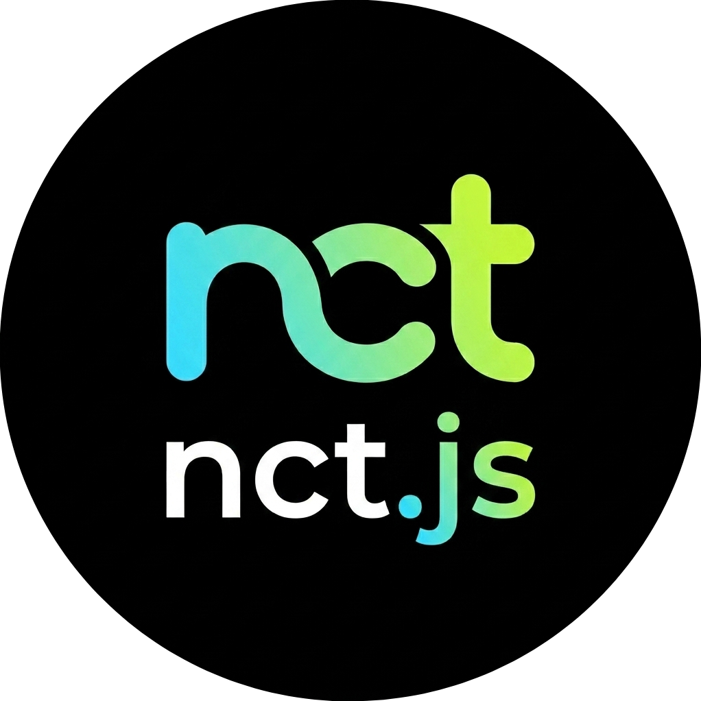

<p align="center">
  
</p>

<h1 align="center">nct.js</h1>

A zero-dependency Node.js client library for the NhacCuaTui (NCT) API. It supports searching, fetching song streaming URLs, parsing lyrics, browsing topic categories, and handling user sessions/login.

Built with native `fetch` (requires Node.js 18+). Supports both CommonJS and ES Modules (TypeScript).

[Tiếng Việt](docs/readme_vi.md) | English

## Table of Contents

- [Installation](#installation)
- [Quick Start](#quick-start)
  - [CommonJS (JavaScript)](#commonjs-javascript)
  - [ES Modules (TypeScript)](#es-modules-typescript)
- [Features](#features)
  - [Client Configuration](#client-configuration)
  - [Authentication & User Data](#authentication--user-data)
  - [Browsing & Discovery](#browsing--discovery)
  - [Details & Recommendations](#details--recommendations)
  - [Search](#search)
  - [Notifications & Devices](#notifications--devices)
- [Development](#development)
  - [Build](#build)
  - [Test](#test)
- [License](#license)

---

## Installation

```bash
npm install nct.js
```

## Quick Start

### CommonJS (JavaScript)

```javascript
const NhacCuaTui = require('nct.js');
const nct = new NhacCuaTui({ logLevel: 'info' });

async function run() {
  // Search for songs
  const searchResult = await nct.searchSongs('Chúng Ta Của Tương Lai', 1, 5);
  console.log(searchResult.songs);

  if (searchResult.songs.length > 0) {
    // Fetch streaming URLs and details
    const song = await nct.getSongDetail(searchResult.songs[0].key);
    console.log(song.streams);
  }
}
run();
```

### ES Modules (TypeScript)

```typescript
import NhacCuaTui, { Song } from 'nct.js';
const nct = new NhacCuaTui();

async function run() {
  const song: Song | null = await nct.getSongDetail('m0ooS1OfYFVi');
  console.log(song?.streams);
}
run();
```

## Features

### Client Configuration
Instantiate the client with optional configuration:
```javascript
const nct = new NhacCuaTui({
  token: 'existing_jwt_token', // Optional session token
  logLevel: 'info' // 'debug' | 'info' | 'warn' | 'error' | 'none' (default: 'none')
});
```

### Authentication & User Data
- **`login(account, password)`**: Logs in to an NCT account. Automatically hashes the password using MD5, performs the auth request, and sets the active session token.
- **`getUserInfo()`**: Fetches profile data of the logged-in user.
- **`getUserPlaylists(page = 0, size = 999)`**: Retrieves user-created cloud playlists.
- **`getUserFollowedPlaylists(page = 0, size = 999)`**: Retrieves followed playlists.
- **`getUserFollowedAlbums(page = 0, size = 999)`**: Retrieves followed albums.

### Browsing & Discovery
- **`getHome()`**: Fetches homepage structure containing hot tracks, albums, playlists, and sections.
- **`getTrendingList()`**: Fetches current hot charts (e.g. V-Pop, US-UK, K-Pop).
- **`getTopicCategories()`**: Lists available browse categories (tabs).
- **`getTopicCategoryDetails(categoryId, page = 1, size = 30)`**: Lists playlist groups/items within a category.

### Details & Recommendations
- **`getSongDetail(songKey)`**: Returns metadata, artist list, duration, and direct CDNs/streaming URLs.
- **`getPlaylistDetail(playlistKey)`**: Returns playlist/album metadata along with its track list.
- **`getLyrics(songKey)`**: Returns lyrics (either plain text or parsed timestamped LRC lines).
- **`getSimilarSongs(songKey, page = 1, size = 20)`**: Returns recommended similar tracks (useful for autoplay).

### Search
- **`searchAll(keyword)`**: Executes a unified search across tracks, playlists, albums, artists, videos, and recommendations.
- **`searchSongs(keyword, page = 1, size = 20)`**
- **`searchPlaylists(keyword, page = 1, size = 20)`**
- **`searchAlbums(keyword, page = 1, size = 20)`**
- **`searchArtists(keyword, page = 1, size = 20)`**
- **`searchVideos(keyword, page = 1, size = 20)`**
- **`searchLyrics(keyword, page = 1, size = 20)`**
- **`getSuggestions(prefix)`**: Autocomplete suggestions as a user types.
- **`getHotKeywords()`**: Returns trending keywords.

### Notifications & Devices
- **`initNotifications()`**: Initializes user notifications.
- **`getNotifications(page = 1, size = 30)`**: Lists push notifications.
- **`saveFcmToken(fcmToken)`**: Registers Firebase Cloud Messaging token.
- **`checkAppUpgrade()`**: Verifies current application upgrade configurations.
- **`getPopupConfigs()`**: Fetches popup configurations.
- **`getActivityInfo()`**: Fetches active campaigns.

## Development

### Build
To compile the TypeScript source into both ES Modules and CommonJS outputs:
```bash
npm run build
```

### Test
Run the integration test suite (targets live NCT APIs):
```bash
npm test
```

## License
MIT
